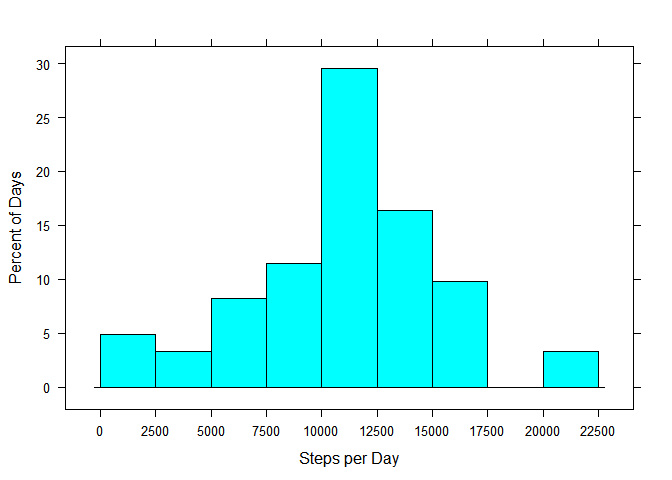
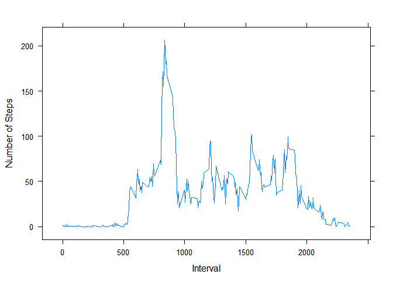
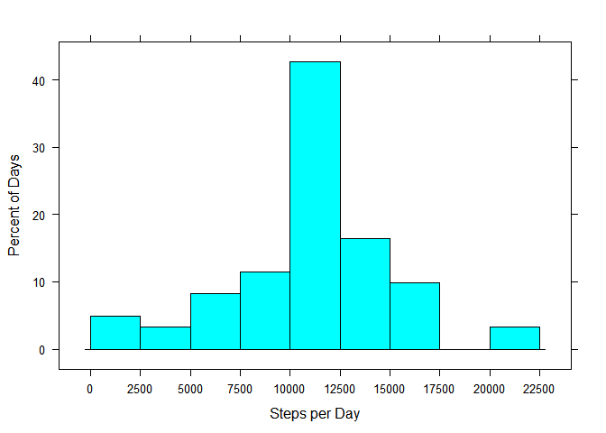
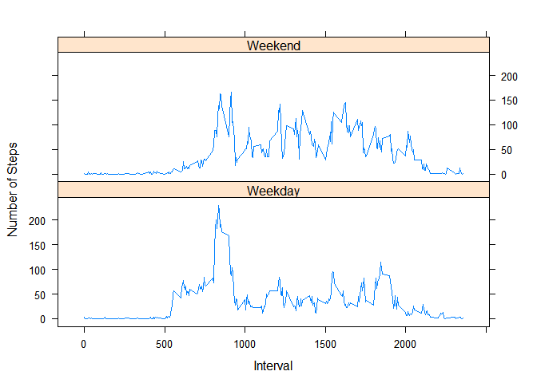

# Reproducible Research: Peer Assessment 1

#### **an analysis of data recorded by a personal activity monitoring device**
The data consists of two months of data from an anonymous individual  
collected during the months of October and November, 2012  
and include the number of steps taken in 5-minute intervals each day.

The variables included in this dataset are:  
**steps**: Number of steps taking in a 5-minute interval (missing values are coded as NA)  
**date**: The date on which the measurement was taken in YYYY-MM-DD format  
**interval**: Identifier for the 5-minute interval in which measurement was taken

***

* Load the data from activity.zip.
    +   Also load dplyr and lattice libraries.  


```r
## Loading and preprocessing the data
activity <- read.csv(unz("activity.zip", "activity.csv"), header=TRUE, quote="\"")
library("dplyr", quietly = TRUE, warn.conflicts = FALSE)
library("lattice", quietly = TRUE, warn.conflicts = FALSE)
```

*17568 records have been loaded.*

***


* Aggregate the data by day, without imputing missing values.  
* Make a histogram of steps per day, with nice x_breaks.  
* Compute mean and median number of steps per day.  


```r
## What is mean total number of steps taken per day?
days <- activity %>% group_by(date) %>% summarize(totsteps=sum(steps))
x_breaks=c(0,2500,5000,7500,10000,12500,15000,17500,20000,22500)
avgstepsperday <- round(mean(days$totsteps, na.rm=TRUE),2)
medianstepsperday <- round(median(days$totsteps, na.rm=TRUE),2)
histogram(days$totsteps, xlab="Steps per Day",
                ylab="Percent of Days",breaks=x_breaks,
                scales=list(x=list(at=x_breaks)))
```



*The mean number of steps per day is 10766.19.*  
*The median number of steps per day is 10765.* 

***

* Agregate the data by interval and then plot the average daily activity pattern.  
* Calculate which 5-minute interval has the highest average number of steps.
* Also caclulate the value of that highest average number of steps.
    +   (The missing values have still not been imputed.)  


```r
## What is the average daily activity pattern?
intervals <- activity[complete.cases(activity),] %>%
  group_by(interval) %>% summarize(avgsteps=mean(steps), na.rm=TRUE)
moststeppyinterval <- as.numeric(intervals[intervals$avgsteps
                                           ==max(intervals$avgsteps),][1:1])
maxnumberofsteps <- round(as.numeric(intervals
                                     [intervals$avgsteps
                                     ==max(intervals$avgsteps),][2:2]),2)
xyplot(intervals$avgsteps ~ intervals$interval, type="l",
      xlab="Interval", ylab="Number of Steps")
```



*The maximum average number of steps in an interval is 206.17.*  
*This occurs in interval 835.* 

***

* Impute the missing values.  
* Use the average number of steps for that time interval for days for which the value is not missing.
* Make a revised histogram of steps per day, with the same nice x_breaks.
* Describe the missing values, as a count and as a percentage of all observations.
* Re-calculate the mean and median number of steps per day.


```r
## Imputing missing values
whichna <- activity[is.na(activity$steps),]  #records of activity with steps=NA 
nna <- nrow(whichna)
pctna <- round(nna/nrow(activity)*100,2) 
#In whichna, replace NAs with avg #steps for interval:
imputed <- select(merge(whichna, intervals, by="interval"),
                  avgsteps, date, interval) #select only needed cols of merge
colnames(imputed) <- colnames(activity) #fix column names: change avgsteps to steps
imputed <- arrange(rbind(activity[complete.cases(activity),],
           imputed),date)#add complete.cases(activity) to imputed,sort by date   
days2 <- imputed %>% group_by(date) %>% summarize(totsteps=sum(steps))
avgstepsperday <- round(mean(days2$totsteps, na.rm=TRUE),2)
medianstepsperday <- round(median(days2$totsteps, na.rm=TRUE),2)
histogram(days2$totsteps, xlab="Steps per Day",
                ylab="Percent of Days",breaks=x_breaks,
                scales=list(x=list(at=x_breaks)))
```



*The number of missing values is 2304.*   
*The percentage of missing values is 13.11%.*  

*With imputed missing values, the mean number of steps per day is 10766.19.*  
*With imputed missing values, the median number of steps per day is 10766.19.*

***

* For each observation, calculate whether it occured on the weekend or on a weekday.  
* Aggregate by interval to find the average weekend day and the average weekday.
* Plot the average activity patterns for weekend and weekday. 


```r
## Are there differences in activity patterns between weekdays and weekends?
imputed$when <- as.factor(ifelse(weekdays(as.Date(imputed$date))
                                 %in% c("Saturday", "Sunday"),
                                 "Weekend", "Weekday"))
intervals2 <- imputed %>%
              group_by(when, interval) %>% summarize(avgsteps=mean(steps))
xyplot(intervals2$avgsteps ~ intervals2$interval|intervals2$when,
              xlab="Interval", ylab="Number of Steps", type="l", layout=c(1,2))
```


